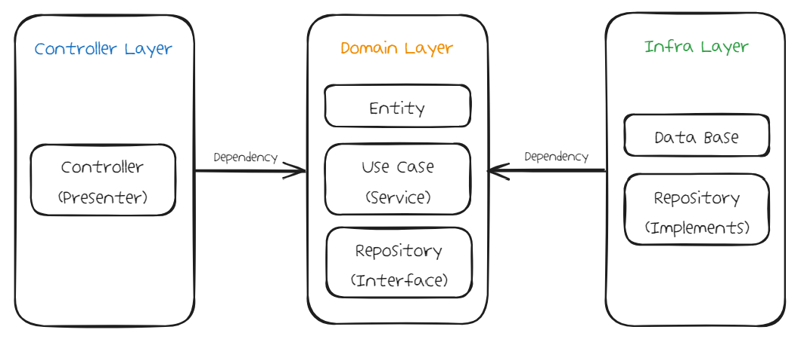

# hhplus02_architecture

## [항해 플러스 백엔드 2주차] 클린 아키텍처

### 요구사항 분석
- 특강 목록 조회, 등록, 삭제 api
  - 여러 개의 특강을 날짜 별로 등록할 수 있다. (수강 정원은 30명으로 고정하지 않았으나, 등록 시 제어한다.)
  - 같은 이름의 특강을 등록할 수 없다.
  - 특강의 전체 목록을 조회할 수 있다. (특강 상세 보기 화면은 구현하지 않음)
  - 종료되었거나, 수강 신청자가 없는 특강은 삭제할 수 있다.
- 특강 신청 api
  - 특강을 선택하여 신청할 수 있다.
  - 각 유저는 동일한 특강을 중복으로 신청할 수 없다.
  - 동시적인 신청 요청에 대하여 동시성을 제어하며, 순차적으로 처리한다.
  - 수강 정원이 다 찬 특강은 신청할 수 없다.
- 특강 신청 여부 조회 api
  - 각 유저에 대해 특강 신청 내역이 존재하는지의 메세지를 반환한다.
- 특강 신청 취소 api
  - 아직 진행하지 않은 특강 신청을 취소할 수 있다.

### 작업 내용
- ~2024/03/25 월
  - TDD 기반으로 service 계층의 구현 객체와 명세 구현
  - 서비스 계층을 추상화, 각 기능 책임에 따라 서비스 컴포넌트를 분리
  - domain Entity와 Repository 계층 구현
  - controller 계층 구현
  - 서비스 로직 동시성 제어 로직 구현 (비관적락 적용)
  - 테스트용으로 H2 인메모리 모드로 연결 후 테스트
- 2024/03/26 화
  - docker-compose 이용하여 mysql database 연결
    - (*수정 : H2 database 서버 모드 로컬 연결 stuck 이슈로 DB 툴 mysql로 변경*)
  - 동시성 제어 로직 통합 테스트
- 2024/03/27 수
  - 동시성 제어 로직 수정 (비동기 -> 동기)
  - ~~SOLID 원칙 적용하여 아키텍처 부분 수정~~
  - 멘토링 후 아키텍처 구조, 엔티티 네이밍 변경
- 2024/03/28 목
  - 특강 목록 조회, 등록, 삭제, 신청 취소 api 구현
  - 심화 기능 테스트 작성

### Architecture

### ERD 명세

### 2주차 인사이트
- 클린 아키텍처
  - 레이어드 아키텍처와 헥사고날 아키텍처의 퓨전
    - 의존성 역전
      : 상위 수준 모듈은 하위 수준 모듈에 의존하면 안되며, 추상화된 인터페이스에 의존
    
    - 독립성
      : 각 계층의 내부 변경이 외부 계층에 영향을 미치지 않아야 한다.
  
    - 명확한 경계
      : 각 계층의 경계는 명확하며, 인터페이스를 통해 상호작용한다.
  
  - 처음 접근할 때에는 깊은 이해가 없어
  평소 쓰던 레이어드 아키텍처에 단지 인터페이스를 중간 의존체로 추가하기만 하고,
  기능별로 더 잘게 컴포넌트화 시키는 것에 그쳤다.
  - 아키텍처를 잡는다는 것이 어떤 의미인지,
  - 각 계층에 대해 명확한 경계와 책임을 둘 수 있는 구조를 생각하게 되었다.

- 동시성 처리
  - DB 락
    - 낙관적 락을 쓰는 것이 DB 부하에 이롭다.

- 오버 엔지니어링
  - 개발을 진행하다 보니 나의 좋지 못한 습관이 있었음
  - 쪼개는 것에 심취하면 너무 쪼개거나, 확장하다보니 너무 확장하거나..
  - 항상 과하지 않게 적정한 레벨을 유지하도록 생각하기

### 기술 스택 결정
- Jpa
- Mysql
- PessimisticLock

### 테스트 시나리오
- 테스트 코드 주석 참고

### 내가 생각하는 clean code란?
- 가독성 : 읽기 쉬운 코드
  - 개인적으로 한글 주석을 활용하는 것을 좋아함
- 책임 분리 : 유지보수가 쉬운 코드

