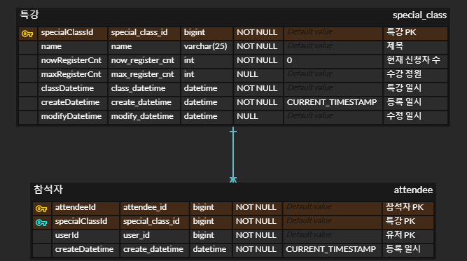

# hhplus02_architecture

## [항해 플러스 백엔드 2주차] 클린 아키텍처

### 요구사항 분석
- 특강 신청 api
  - 특강은 주어지며, 각 유저는 동일한 특강을 중복으로 신청할 수 없다.
  - 동시적인 신청 요청에 대하여 동시성 제어가 필요하며, 순차적으로 처리한다.
  - 수강 정원이 다 차면 신청할 수 없다.
- 특강 신청 여부 조회 api
  - 각 유저에 대해 특강 신청 내역이 존재하는지의 여부를 반환한다.

### 작업 내용
- ~2024/03/25 월
    - TDD 기반으로 service 계층의 구현 객체와 명세 구현
    - 서비스 계층을 추상화하여 주입하고, 각 기능 책임에 따라 서비스 컴포넌트를 분리
    - domain Entity와 Repository 계층 구현
    - controller 계층 구현
    - 서비스 로직 동시성 제어 로직 구현 (비관적락 적용)
    - 테스트용으로 H2 서버 모드로 연결 후 통합 테스트 작성
    - *~ing : 통합 테스트 동시성 처리 케이스 작성 중*

### ERD 명세

### 기술 스택 결정

### 테스트 시나리오

### 내가 생각하는 clean code란?

